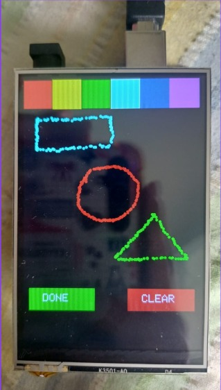
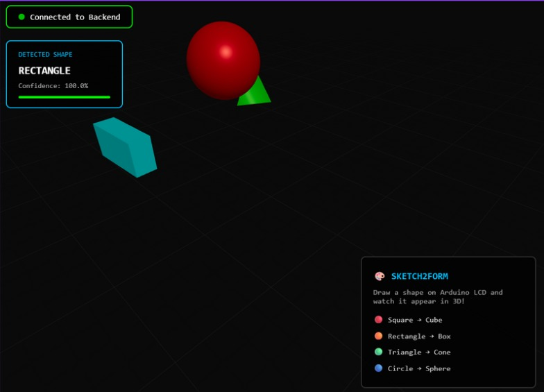
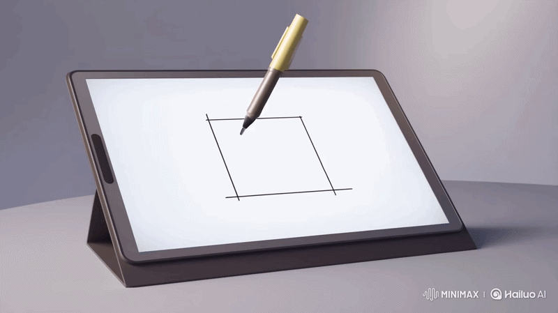
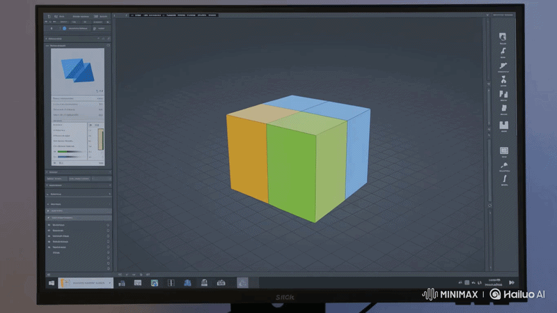
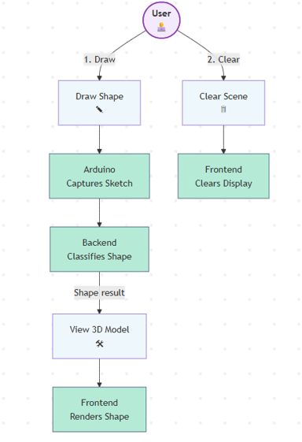
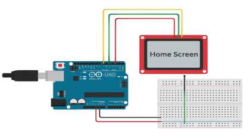

# Sketch2Form: 2D to 3D Shape Visualization

<p align="center">
  <strong>Turn freehand sketches on an Arduino touchscreen into real-time 3D objects using AI.</strong>
</p>

## Overview

Sketch2Form is an interactive sketch-to-visualization system that captures freehand drawings on an Arduino-based touchscreen, classifies them using a trained machine learning model, and renders the recognized output as interactive 3D objects in a browser. The project was built to make 3D creation more intuitive, accessible, and immediate for users who may not be familiar with traditional CAD or modeling tools.

The complete pipeline connects physical sketch input, backend AI inference, and browser-based rendering into one continuous real-time workflow. A user draws a basic geometric shape such as a square, rectangle, triangle, or circle on the touchscreen, and the system converts that sketch into a corresponding 3D form on the web interface.

## Motivation

Traditional 3D modeling tools are powerful, but they are often difficult for beginners because they depend on complex interfaces, technical workflows, and prior modeling experience. Sketch2Form was motivated by the idea of making digital creation feel as natural as sketching on paper while still using modern AI and visualization techniques.

The project explores how embedded systems, machine learning, and real-time graphics can work together to lower the barrier to digital prototyping. This makes the concept especially relevant for STEM education, early-stage design ideation, accessible creativity tools, and interactive learning environments.

## Example Output

<p align="center">
  
  &nbsp;&nbsp;&nbsp;
  
</p>

<p align="center">
  <em>Left: the touchscreen drawing surface. Right: the corresponding 3D visualization rendered in the frontend.</em>
</p>

## What the Project Does

<p align="center">
  
  &nbsp;&nbsp;&nbsp;
  
</p>

- Captures freehand sketch data from an Arduino touchscreen.
- Records point sequences along with coordinates, time, and selected color.
- Sends sketch data to a Python backend over serial communication.
- Classifies the sketch into geometric categories using a trained ML model.
- Broadcasts the recognized result to a web frontend in real time.
- Renders the detected shape as an interactive 3D object using Three.js-compatible tooling.

## System Architecture

The project is organized as a three-stage pipeline:

1. **Hardware input layer** – an Arduino touchscreen acts as the drawing surface and streams sketch data.
2. **AI backend layer** – a Python backend listens for incoming points, preprocesses them, runs shape classification, and sends results onward.
3. **Visualization layer** – a React + Three.js frontend receives recognized shapes through WebSocket and spawns the corresponding 3D objects.

<p align="center">
  
  &nbsp;&nbsp;&nbsp;
  
</p>

## Hardware Components

The prototype uses low-cost and widely available components so the system remains practical and reproducible. The hardware stack described in the report includes the following:

- **Arduino Uno / Mega / compatible microcontroller** for touchscreen interaction and serial communication.
- **TFT LCD touchscreen shield** for shape drawing, color selection, and control buttons.
- **USB connection** for power and serial data transfer to the backend system.
- **Laptop or desktop computer** to run the backend server and the web frontend.
- **Breadboard / jumper wires** if additional wiring or extension connections are required.

## Software Stack

### Embedded / Arduino Side
- Arduino IDE
- Touchscreen libraries such as `MCUFRIEND_kbv` and `TouchScreen.h`
- Custom firmware for sketch capture, point serialization, and clear/done events

### Backend
- Python 3.x
- FastAPI
- PySerial
- TensorFlow / TensorFlow Lite
- NumPy
- JSON handling utilities

### Frontend
- React
- Three.js
- `@react-three/fiber`
- WebSocket client
- Modern browser runtime (Chrome, Edge, Firefox)

## Implementation Details

### 1) Hardware Interface
The hardware module acts as the drawing surface. The touchscreen detects touch and pressure events, records x-y positions, timestamps, and selected colors, and maps user taps to a color palette as well as `DONE` and `CLEAR` controls. During sketching, the Arduino continuously sends JSON-like point data through serial communication so that the backend can reconstruct the full stroke sequence.

### 2) AI Detection and Backend Processing
The backend reads serial input in real time, detects sketch boundaries, buffers the captured points, and preprocesses them before inference. Once a sketch is completed, the backend normalizes the point sequence and passes it to the trained classifier, which predicts the most likely shape category. The result is then broadcast to the frontend for visualization, while duplicate detections can be filtered and recognition results can be logged for analysis.

### 3) Frontend Visualization
The frontend receives shape labels and metadata over WebSocket and maps them to corresponding 3D geometries such as cubes, spheres, and cones. The rendered object appears inside a live 3D scene, allowing the user to immediately see how a 2D sketch has been interpreted and transformed into a digital object.

## Dataset Creation

A major part of this project was creating the dataset from scratch instead of relying entirely on an off-the-shelf sketch dataset. The system collects raw point sequences from hand-drawn sketches made by users, where each drawing is represented as a sequence of coordinates and associated drawing attributes such as time and color. The custom dataset focused on core geometric classes including **square, rectangle, triangle, and circle**. 

To improve generalization, sketches were collected from multiple users so the model would learn from variations in speed, size, stroke order, and drawing style. This ensured that the final classifier was not overfitted to one person’s drawing behavior and could respond more reliably during live demonstrations.

### Dataset Preparation Workflow
- Users drew shapes repeatedly on the touchscreen interface.
- Each sketch was stored as a sequence of points.
- Drawings were labeled by shape class.
- The collected data was cleaned and normalized.
- Point sequences were prepared in a format suitable for model training.

## Model Training

The AI component was trained on the newly collected hand-drawn dataset using TensorFlow Lite-based shape classification. The report states that the model was trained on thousands of point-sequence samples and achieved **over 90% validation accuracy** on the core geometric classes used in the project.

The training process focused on mapping normalized point sequences to shape labels, allowing the backend to perform fast inference during real-time usage. The resulting lightweight model was suitable for practical deployment in a low-cost prototype where inference could still run efficiently on a standard laptop CPU without requiring dedicated GPU hardware.

## Project Structure

```text
Sketch2Form/
├── arduino/                             # Touchscreen firmware
├── assets/                              # Readme file assets
├── backend/                             # FastAPI server, serial listener, ML inference
├── dataset_collection/                  # Collected sketch samples and labels (if included)
├── frontend/                            # React + Three.js visualization app
├── shape_classifier_model/              # Trained model artifacts
└── README.md
```

## Setup Overview

### Hardware Setup
1. Connect the TFT touchscreen to the Arduino board.
2. Upload the touchscreen sketch firmware using Arduino IDE.
3. Connect the board to the host system over USB.

### Backend Setup
1. Create a Python environment.
2. Install backend dependencies.
3. Start the FastAPI server and serial listener.
4. Ensure the trained model file is available to the inference module.

### Frontend Setup
1. Install Node.js dependencies.
2. Start the React development server.
3. Open the local frontend in a browser.
4. Draw on the Arduino touchscreen and observe the 3D output. 

### Demo Video
- **Demo Video:** (https://drive.google.com/file/d/1cIdvhboVEUSlr9opdjpFIzPnXLAL3sLB/view?usp=drive_link)